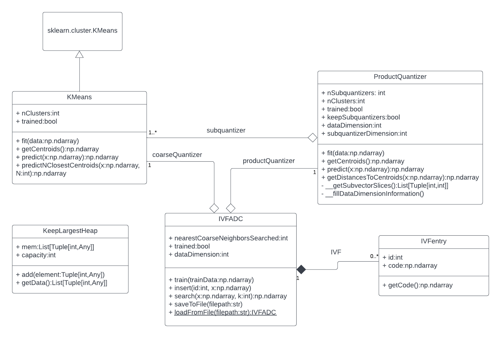
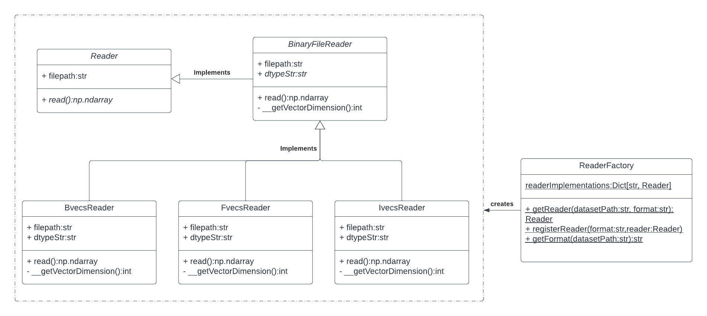

# Project scope

## Introduction

Similarity search in large scale, high dimensional datasets is an essential feature of many different applications, such as scene recognition. Fundamentally, any data can be seen as a high dimensional vector and embeddings are frequently used to try and reduce the dimensionality of the representation and extracting abstract features from the original data.

However, due to the "curse of dimensionality" exhaustively searching for a set of nearest neighbors is prohibitively expensive and traditional indexing strategies don't fare much better. Approximate nearest neighbor searches at first tackled the problem of the time complexity by looking for a nearest neighbor with high probability instead of the one with probability 1. However, storing the indexed vectors in memory still posed a serious limit in capacity.

The approach proposed by Jegou, H. et. al. in [Product quantization for nearest neighbor search](https://lear.inrialpes.fr/pubs/2011/JDS11/jegou_searching_with_quantization.pdf) circumvents these memory constraints by storing a short code in memory obtained through product quantization instead of the original vectors. This results in a time and memory efficient solution to indexing vectors and performing approximate nearest neighbor search.

## Proposed project

The project being proposed consists of implementing the quantization algorithms and indexing structure described in the paper [Product quantization for nearest neighbor search](https://lear.inrialpes.fr/pubs/2011/JDS11/jegou_searching_with_quantization.pdf).

The inverted file system with asymmetric distance (IVFADC) will be implemented as a package library in Python with supporting methods to train, index the dataset and execute queries against it. A configurable script driving the library will also be provided to allow the evaluation of the performance of different parameters.

The project must implement a parser for the file formats described in [Datasets for approximate nearest neighbor search](http://corpus-texmex.irisa.fr/) to allow for easy usage of the provided datasets and support for new file formats should be possible to be added.

The performance metric used on the literature is recall@R: the average rate of queries in which the nearest neighbor is ranked within the top R positions.

A list of itemized requirements can be found in [docs/Requirements.md](Requirements.md).

## System architecture

The main classes implementing the algorithm and indexing structures are described in the following UML class diagram:

Supporting classes for parsing the data from disk are described here and implement a simple Factory Pattern with implementation registration:

